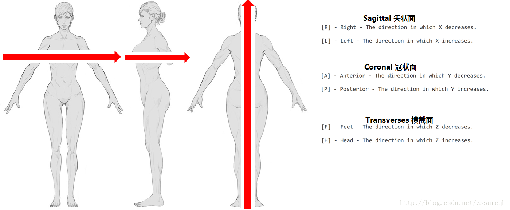

# 图像处理
1. 图像识别
1. 图像可视化

## 坐标系
* [坐标系](https://www.cnblogs.com/biaohuang/p/14419118.html), [坐标系](https://blog.csdn.net/weicao1990/article/details/82688446)

| 坐标系 | 说明 |
| :----: | ---- |
| 世界坐标系 |  |
| 人体/解剖学坐标系 | 单位是mm |
| 图像坐标系 | 单位是点(因为间距不定，点的mm也不定)，原点在左上角。i坐标轴向右递增，j坐标轴向下递增，k坐标轴向后递增。 |

### 人体坐标系和图像坐标系

* 轴状位/横断面（The axial plane）:脚部(Inferior), 头部(Superior)
* 图像坐标系转换到人体坐标系：通过图像的原点和间距，计算其在人体坐标系中的对应位置

### Dicom坐标tag
| TAG | 英文说明 | 说明 |
| :----: | ---- | ---- |
| Image Position (Patient) | The x, y and z coordinates of the upper left hand corner of the image, in mm. | 图像的左上角在空间坐标系中的x,y,z坐标,单位是毫米. 如果在检查中,则指该序列中第一张影像左上角的坐标. |
| Image Orientation (Patient) | The direction cosines of the first row and the first column with respect to the patient. | 人体扫描时的朝向 |

### 第三方库的坐标信息
| 类型 | 坐标系 | 坐标原点 | 图像首个像素(左上角)存储位置 |
| :----: | ---- | ---- | ---- |
| ITK | LPS：（Left，Posterior，Superior）| 图像的左下角 | 左上角 |
| VTK |  | 图像的左下角 | 左下角 |
| 3D Slicer | RAS：（Right，Anterior，Superior） |  |  |

### 像素和物理坐标系转换
```
像素到物理：physics[i] = origin[i] + pixel[i] * spacing[i]。像素*层间距+起始坐标offset
物理到像素：pixel[i] = (physics[i] - origin[i])/spacing[i] + 0.5 // 0.5是为了向上取整
```

1. i是0/1/2。也就是XYZ轴的值
1. 像素类型是int，其他是double
1. origin和spacing是参数

## 可视化实现方式
| 渲染方式 | 技术 | 优势 | 劣势 |
| :-: | - | - | - |
| 后端 | 离屏渲染(VTK EGL)+websocket | 支持复杂操作，终端开发容易 | 依赖网络带宽，需要后端大量的内存和算力 |
| 前端H | H5+js库 | 终端不同可复用 | 依赖终端的内存和算力；复杂操作的支持度有限制 |
| 前端C | QT+VTK | 支持复杂操作 | 依赖终端的内存和算力；终端不同需重做，比如手机端要换QT |

## 第三方库
| 类型 | 名称 | 说明 |
| :----: | ---- | ---- |
| ITK | 图像操作工具包 | 图像分析和处理 |
| VTK | 图像可视化操作工具包 | 三维显示和三维模型操作，visualization |
| [VTK的前端库](https://kitware.github.io/vtk-js/) |  | 支持pad和手机 |

## 资料
* [【相机标定】四个坐标系之间的变换关系](https://cloud.tencent.com/developer/article/1820935)
* [ITK与VTK数据转换](https://blog.csdn.net/menjiawan/article/details/47283809)
* https://www.incool3d.com/
* https://www.weiyunyingxiang.com/
* [可视化重建](https://www.iih.xin/productinfo/1410267.html)
