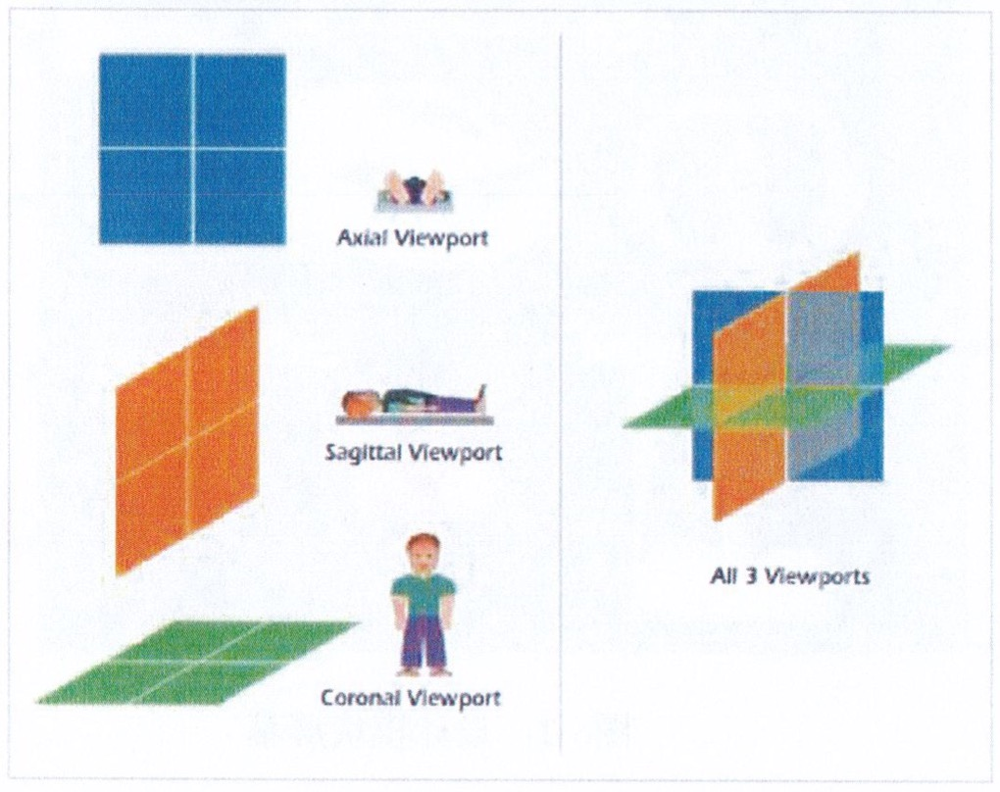
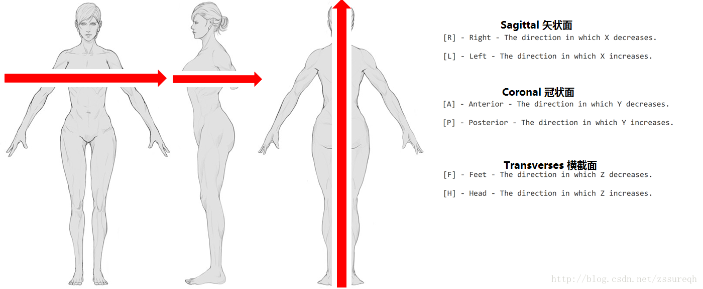

# 坐标系
> 规则: 第三方库（ITK、VTK等)采用其内部的图像坐标系，跨库通讯采用物理坐标系

* [医学图像中解剖学坐标系](https://www.cnblogs.com/biaohuang/p/14419118.html)
* [图像坐标系，相机坐标系和世界坐标系](https://blog.csdn.net/weicao1990/article/details/82688446)
* [【相机标定】四个坐标系之间的变换关系](https://cloud.tencent.com/developer/article/1820935)

| 坐标系 | 说明 |
| :----: | ---- |
| 物理坐标系 | 单位是mm，如某台CT设备的物理坐标系 |
| 人体/解剖学坐标系 | 单位是mm |
| 图像坐标系 | 整数，单位是像素(因为间距不定，点的mm也不定)，原点在左上角。i坐标轴向右递增，j坐标轴向下递增，k坐标轴向后递增。 |

## 人体
* 矢状面
* 冠状面
* 轴位面/横断面（The axial plane）:脚部(Inferior), 头部(Superior)



## Dicom坐标tag
| TAG | 英文说明 | 说明 |
| :----: | ---- | ---- |
| Image Position (Patient) | The x, y and z coordinates of the upper left hand corner of the image, in mm. | 图像的左上角在空间坐标系中的x,y,z坐标,单位是毫米. 如果在检查中,则指该序列中第一张影像左上角的坐标. |
| Image Orientation (Patient) | The direction cosines of the first row and the first column with respect to the patient. | 人体扫描时的朝向 |

## 第三方库的坐标信息
| 类型 | 坐标系方向 | 坐标原点 | 图像首个像素(左上角)存储位置 |
| :----: | ---- | ---- | ---- |
| ITK | LPS：（Left，Posterior，Superior）| 图像的左下角 | 左上角 |
| VTK |  | 图像的左下角 | 左下角 |
| 3D Slicer | RAS：（Right，Anterior，Superior） |  |  |

## 图像坐标系和物理坐标系转换
```
图像到物理：physics[i] = origin[i] + pixel[i] * spacing[i] // 起始坐标offset + 图像值 * 层间距
物理到图像：pixel[i] = (physics[i] - origin[i])/spacing[i] + 0.5 // 0.5是为了向上取整
```

1. i是0/1/2。也就是XYZ轴的值
1. 图像的是int，其他是double
1. origin和spacing是Dicom的Tag
