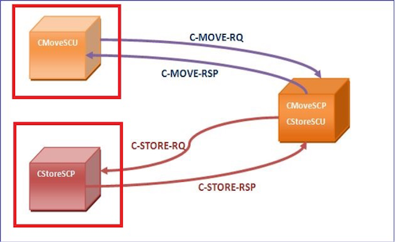

# DICOM
* 医学数字成像和通信(Digital Imaging and Communications in Medicine)
* [官网](https://www.dicomlibrary.com/)
* [DICOM](https://baike.baidu.com/item/DICOM/2171358)

## 数据结构和字段
* [Dicom数据结构](https://zhuanlan.zhihu.com/p/102590860)
* [数据类型](https://blog.csdn.net/inter_peng/article/details/46513847)
* [字段定义](http://dicom.nema.org/dicom/2013/output/chtml/part06/chapter_6.html)
* [人体常见组织CT值](https://www.jianshu.com/p/3778324574d4)
* [GE](http://www3.gehealthcare.co.uk/~/media/documents/us-global/products/interoperability/dicom/radiology-pacs-ris/gehc-dicom-conformance_pathspeedpacs-v8-1_iisfp10282_rev2.pdf)，[GE Private TS](https://blog.csdn.net/zssureqh/article/details/47222685)
* 窗宽窗位: 窗宽（Window Width,简写WW）、窗位（Window Level,简写WL）。是对于密度值的筛选。
  * 范围的计算公式 = [窗位-窗宽/2，窗位+窗宽/2]。如窗宽值为300，窗位为-100，那么窗宽窗位的范围是-250到50。
  * 密度值小于最小值时就变成最小值，密度值大于最大值时就变成最大值。

## CT值
1. 原始像素值存储在PixelData中，通常是一个16位有符号整数类型，即signed short，取值范围为-32768到+32767
1. 像素值到CT值公式见下文
1. CT图像上每个像素所对应的物质对X线线性衰减量平均大小的表示，单位为HU(Housfield Units，豪斯菲尔德是发明CT扫描仪的英国科学家)

## 灰度显示
* [DICOM转换为灰度图的过程](https://zhuanlan.zhihu.com/p/554873927)


* Modality LUT(像素值到CT值)：(像素值 * RescaleSlope) + RescaleIntercept
* VOI LUT(CT值到灰度)：窗宽窗位
* RGB：像素值 * (LargestImagePixelValue - SmallestImagePixelValue) / 255

### 字段
| 类型 | 名称 | 说明 |
| :-: | - | - |
| 最小图像像素值 | SmallestImagePixelValue(0028,0106) | 射线衰减值 |
| 最大图像像素值 | LargestImagePixelValue(0028,0107) | 射线衰减值 |
| 缩放截距 | RescaleIntercept(0028,1052) |  |
| 缩放率 | RescaleSlope(0028,1053) |  |
| 窗位 | WindowCenter(0028,1050) |  |
| 窗宽 | WindowWidth(0028,1051) |  |

## 字段值的中文乱码
* DICOM文件本身包括Tag (0008, 0005) Specific Character Set记录编码集，如果没有SpecificCharacterSet时, 以ASCII来处理所有字段。
* 乱码情况：字段中文用GB18030,GBK,UTF8等中文编码，但是SpecificCharacterSet(无字段 || 有字段但值为空 || 有字段但值为ASCII)
* 编码解析优先级：数据库记录的设备(StationName(0008,1010))对应编码，数据库记录的医院对应编码，SpecificCharacterSet

## 通讯协议
* [DICOM通信介绍.pptx](https://medical.wangyaqi.cn/s//radiology/DICOM通信介绍.pptx)
* [Transfer Syntax](https://blog.csdn.net/u014738683/article/details/54573611)
* [SOP](https://blog.csdn.net/u014738683/article/details/54573728)
* [DICOM：C-GET与C-MOVE对比剖析](https://blog.csdn.net/zssureqh/article/details/46868695)

### 术语
| 名称 | 中文 | 说明 |
| - | - | - |
| SOP（Service-Object Pair）| 对象对 | Service(DICOM服务，如存储服务) + Object(DICOM对象，如CT影像) |
| SCP（Service Class Provider）| 服务类提供者 | 服务端 |
| SCU（Service Class User）| 服务类使用者 | 客户端，设备 |
| SOP Class（Service Object Pair Class Unique Identifier）| 对象对类 | 等同Abstract Syntax |
| AE（Application Entity）| 应用实体 | SCP和SCU的实体就是AE。2个AE传输前需确定好：SOP，SCP，SCU，SOP Class |

### 服务命令
| 服务 | 命令 | 说明 |
| - | - | - |
| 存储 | C-STORE | 将图像和数据存储到远程存档中，SCU传输DICOM图像到SCP(PUSH推图模式) <br> 是SCU发起的1次请求操作(查询和数据传输合并成1个请求)。 <br> 使用场景：设备推图(SCU) |
| Query/Retrieve | C-FIND | SCU向SCP请求查询信息 |
| Query/Retrieve | C-MOVE | 检索图像和数据并将其传输回接收方(拉图模式)，检索图像和数据是不同连接 <br> 是两次请求(先查询请求，再数据传输请求) <br> 使用场景：PACS传输影像(C-MOVE的SCP，C-STORE的SCU) <br>  |
| Query/Retrieve | C-GET | 类似C-MOVE，接收方只能是请求方，检索图像和数据是同一个连接 |
| 网络连通检查 | C-ECHO |  |

#### C-FIND
* 查询模型级别（Information model level）:查询目标实体的最高级别(WHERE)
* 查询/检索级别（Query/retrieve level）:查询结果的详细程度(SELECT)，有Patient/Study/Series/Image

如果模型级别设置为Patient，查询/检索级别设置为Study，那么查询将在患者级别进行，返回该患者所有研究的基本属性信息。

#### C-MOVE
1. SCU将查询请求发送给SCP
1. SCP将符合查询条件的数据直接传输到SCU
1. SCU接收和存储这些数据

#### C-GET
1. SCU发送查询请求给SCP
1. SCP返回查询结果
1. SCU使用查询结果发起第二次请求，要求SCP将具体的数据传输给它
1. SCP接收到第二次请求后，传输数据给SCU
1. SCU接收和存储这些数据

### 服务命令工具
* 工具安装 : apt-get install dcmtk，[Windows下载](https://dicom.offis.de/download/dcmtk/dcmtk367/bin/dcmtk-3.6.7-win64-dynamic.zip)
* 命令使用前需要SCU和SCP互信
* 命令通用参数介绍
    * -v 详细log
    * -d 调试
    * -aet : SCU
    * -aec receiver 192.168.0.99 4242 : SCP
#### C-STORE
```
storescu -v -aet <本地AE> -aec <远端AE> <远端IP> <远端端口号> <上传的DICOM文件>

find ${DICOM_PATH} -type f -name "*" -exec storescu -v -aet sender -aec receiver 192.168.0.99 4242 {} \; // 目录发送，基于Linux
storescu -v -aet sender -aec receiver 192.168.0.99 4242 ${DICOM文件路径} // 单个文件发送
```

#### C-FIND
```
findscu -v -P -d -aet <本地AE> -aec <远端AE> <远端IP> <远端端口号> -k QueryRetrieveLevel=STUDY -k StudyInstanceUID=<值>
findscu -v -S -d -aet <本地AE> -aec <远端AE> <远端IP> <远端端口号> -k QueryRetrieveLevel=PATIENT -k PatientID=<值>
```

#### C-MOVE
```
movescu -v -aet <calling_ae_title> -aec <called_ae_title> -<query_level> -k <attribute>=<value> <destination_host> <destination_port>
```

#### C-GET

#### C-ECHO
```
echoscu -d -aet sender -aec receiver 192.168.0.99 4242
```

## 脱敏
* 行业脱敏TAG参考：https://www.dicomlibrary.com/terms-of-service/，https://www.ncbi.nlm.nih.gov/pmc/articles/PMC4636522/
* 匿名但保留追溯能力设计：[{脱敏tag,修改值,原始值}]用json格式保存在1个私有tag上，可以考虑RSA加密内容

## 资料
* [Orthanc-轻量级开源DICOM服务器](https://www.orthanc-server.com/)
