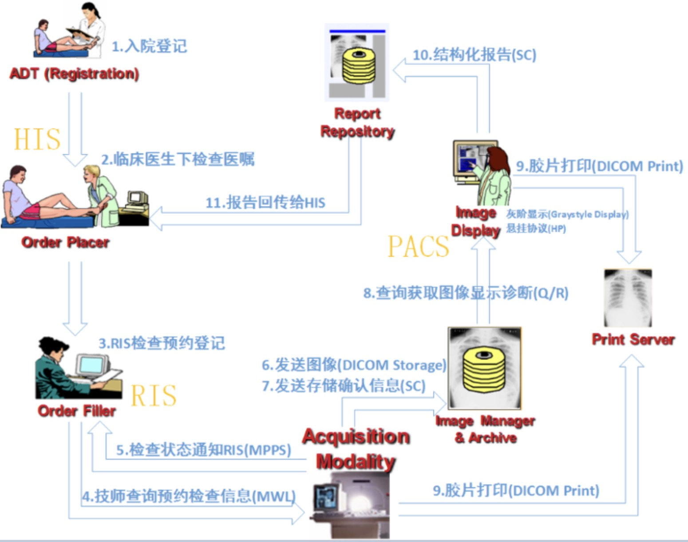
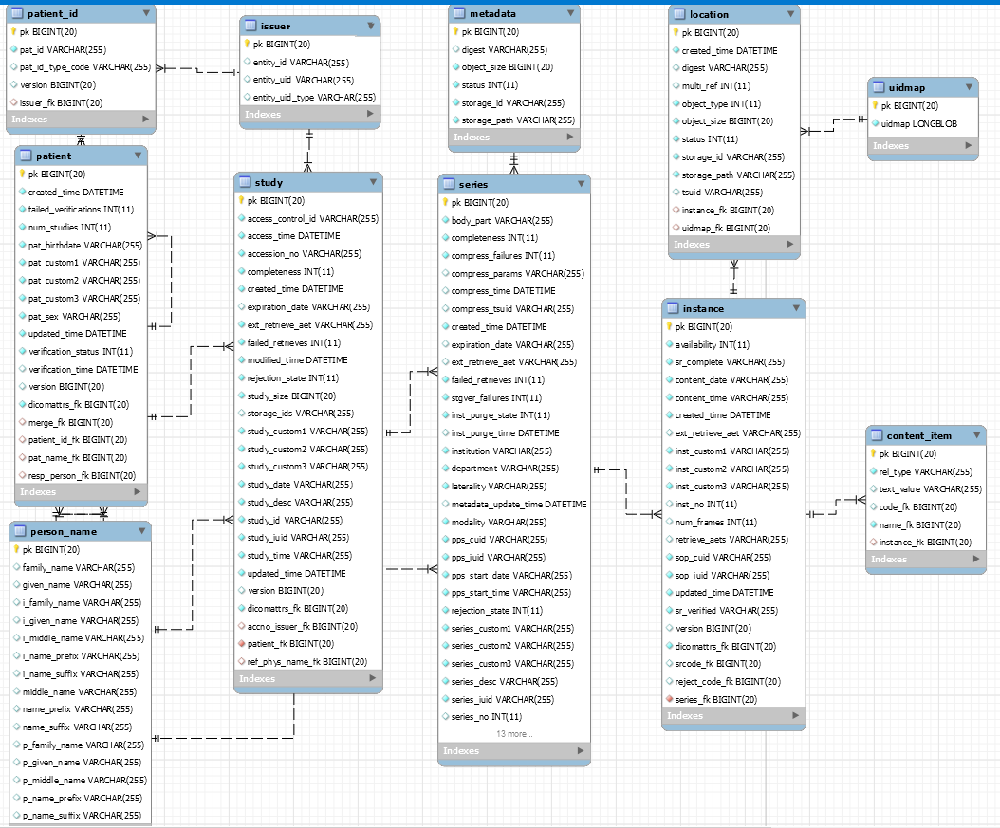

# 放射科

## 术语
### 名词
| 英文 | 中文 | 说明 |
| :----: | ---- | ---- |
| patient | 病患 |  |
| study | 检查 |  |
| series | 影像序列 |  |
| nodule | 结节 | 生物体表面或内部组织中圆形的小突起 |
| nidus | 病灶 | 疾病集中的部位或是综合病症、感染的主要部位 |
| registration | 影像配准 |  |

### 医学成像
| 名称 | 说明 | 数据的物理原理 |
| :----: | ---- | ---- |
| X光 | 用X光给你的身体拍了一张照片的检查方式。所以也叫拍片子 |  |
| CT(计算机体层成像) | 实际上也是用X光给身体拍照片的检查方式。不过不是拍一张，而是要拍很多张，一层一层地查。 | X线衰减系数 |
| B超 | 发出超声波，然后用反射的回声来画像的检查方式 |
| MRI(核磁共振) | 是利用一个强大的磁场，让身体里的氢原子，先排好队再解散，接受这期间的电磁波信号，再给身体内部画像 | 磁共振信号 |
| DR(数字化放射成像) |  |  |
| NCCT(平扫计算机断层扫描) |  |  |
| CTA(CT血管成像) |  |  |
| CTP(CT灌注成像) |  |  |

| 名称 | 说明 |
| :----: | ---- |
| HU | CT图像上每个像素所对应的物质对X线线性衰减量平均大小的表示，称为CT值，其单位为HU（豪斯菲尔德Housfield，英国科学家，发明了CT扫描仪） |
| POI | point of interest，兴趣点，GIS是坐标点 |
| ROI | region of interest，GIS是区域 |

## 影像文件
| 类型 | 全称 | 说明 |
| :----: | ---- | ---- |
| dicom | Digital Imaging and Communication In Medicine | Orthanc - DICOM Server |
| mha/mhd |  | 体数据，mhd包含图像的meta data（信息头）和图像裸数据 |
| NIFTI | Neuroimaging Informatics Technology Initiative | 体数据，nii/nii.gz |
| nrrd |  |  |
| stl |  | 基于dcm等图像，三维重建模型 |
| JPG/PNG/tiff |  | 图片 |

## 资料
### 显示器
* 普通显示器分辨率1920*1080，DELL E2216HV
* 医用专业显示器
  * 黑白影像诊断显示器分辨率是1600*1200。巨鲨JUSHA-M21
* 产品用普通显示器，点击分屏时会把影像及其功能投放到医用专业显示器

### 医院工作流程

### 数据结构

