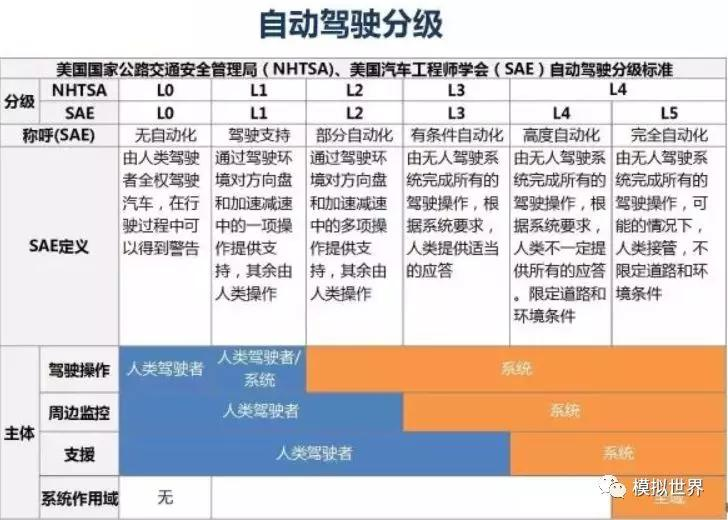

# 手术
## 流程
1. 门诊和拍片(如CT)
1. 诊断(含技师诊断)
1. 术前规划
1. 手术：术中导航，器械手术

## 系统构成
* 软件：术前规划软件，术中导航软件，手术器械操作软件
* 硬件：手术器械

## 数字手术

| 出行 | 医疗 |
| :-: | - |
| 数字地图 | 数字人体 |
| 路线规划 | 手术路径规划 |
| 导航 | 术中导航 |
| 自动驾驶 | 自动手术 |

### 数字人体
| 项 |出行 | 医疗 | 说明 |
| :-: | - | - | - |
| 采集 | 地图采集车 | CT/MR设备 |  |
| 建模 | PoI标注 | 目标分割、多模态融合 |  |

### 手术路径规划
| 项 |出行 | 医疗 | 说明 |
| :-: | - | - | - |
| 设置起点终点 | 目的地设置 | 病灶分割 |  |
| 路线生成和选择 | 路径自动生成、选择 | 路径自动生成、编辑、选择 |  |

### 术中导航
| 项 |出行 | 医疗 | 说明 |
| :-: | - | - | - |
| 定位 | GPS | [电磁传感](https://www.ndigital.cn/%E6%8A%80%E6%9C%AF/%E7%94%B5%E7%A3%81%E8%B7%9F%E8%B8%AA/)、[光纤传感](https://fiber.ofweek.com/2022-09/ART-12008-2100-30575190.html)、[光学定位](https://www.ndigital.cn/%E4%BA%A7%E5%93%81/polaris-vega/) |  |
| 配准 | GPS和地图用的同一坐标系，直接配准 | 通过关键点和点云配准 | 配准数字世界(如虚拟内窥镜)和现实世界(如内窥镜) |
| 融合显示 | 车在地图上显示 | 数字人体(器官、血管)在现实器械所在的画面上显示 |  |
| 实时更新 | 堵车 | 路径微调 | 更新器官形变等信息(如呼吸导致的器官形变) |
| 碰撞预警 | 撞车报警 | 器械 | 器械不能碰动脉 |

### 自动手术
| 项 |出行 | 医疗 | 说明 |
| :-: | - | - | - |
| 自动 | 自动驾驶 | 算法决策并控制机器人进行手术操作 | L1：辅助医生进行重复性较高且简单的操作   L2：在医生的监控下进行复杂操作。如缝合、切除，内窥镜的自动进镜。 |

* [自动驾驶分级是0-5级别](https://new.qq.com/rain/a/20210309A0CAN000), http://m.cheyun.com/content/22813
* 医疗行业标准制订中，比如描述法8级，权重法(连续数字)

